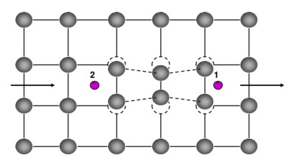
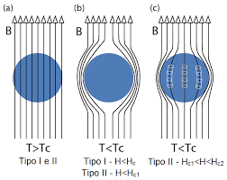

# Super Conductor Simulation
This is a visual representation of the quantum phase states of the cooper pair bonding present within a type I superconductor.
I learned all the physics present within this simulation while attending issyp 2016 in Waterloo Ontario.
This particular simulation uses the XY Monte Carlo random sampling method to get a running time that is reasonable on a modern pc.
Running a perfect simulation of a type I superconductor without this statistical approximation would require the computing strength of a
supercomputer. For this reason, the Monte Carlo random sampling algorithm is a very powerful tool as it allows semi-accurate
approximations that can help develop an intuition for what is occurring physically.
The wonderfull mentorship given to me at issyp taught me the necessary skills to recreate this in javascript.

### Running Instructions:
1. Install **python 3.6 <=**
2. Install **matplotlib**
3. Install **numpy**
4. Run **superconductor.py** with `python3 superconductor.py`

# Explanation of Physics behind Simulation

## What is Super Conductivity?
Superconductivity is a state that certain materials can take where they have zero electrical resistance. This has some weird side
effects, the most prominent being that superconductors repel magnetic fields.
These superconducting states are normally achieved at super low temperatures.
The holy grail of superconductivity would be a room-temperature
superconductor. This would have applications in almost all aspects of day to day life.

## How are Super Conductors described?
Type I superconductors are described using the BCS theory model, first
proposed in 1957. It won the Nobel prize in physics in 1972. In BCS
theory, the material is modeled as a lattice of positive ions with a sea of free electrons. As an electron moves through this lattice,
it attracts the positive ions towards it. This region of higher positive charge can have a delayed attractive effect on another
electron. Thus, these two electrons can have an indirect "attraction". This pairing is called a
cooper pair; a quasi-particle. Because pairs are continually interchanged, the energy required to break anyone cooper pair is the
energy required to break all of the pairs. Electrons on their own are fermions and obey the Pauli exclusion principle. As such,
electrons cannot normally share quantum states. A cooper pair, on the other hand,
is a boson and can form a bose-einstein condensate. This state of matter allows for the sharing of quantum states, and in this case,
facilitates the co-existence of all of the cooper pairs in the lowest
quantum energy state.

## Type I and Type II Super Conductors
There are thirty pure metals which exhibit zero resistance under low temperatures. These are type I superconductors, and also the type
that is being modeled by this simulation. These are modeled by BCS theory and are relatively well understood.

Type II superconductors are those which are made from alloys and cuprate like substances. They have the interesting property of flux
pinning,
where they pin the superconductor to its position in a magnetic field when in-between the first and second critical temperatures. BCS
theory fails to accurately describe type II superconductors. There are no fully worked out explanations as to how these work.

## The XY Model
This is a model commonly used to describe superconductivity and superfluidity. It considers how each relative energy state interacts
with its four nearest neighbors. This is not a perfect representation but gives a good approximation.

### A quick note on Statistical Mechanics
In superconductors, microscopic properties are used to infer and analyze important macroscopic behaviors. With the computational power
available, it is impossible to know all information about all of the microscopic states. Statistical Mechanics uses probabilities and
statistics to calculate the expected state of the system on a macroscopic level. This means that there are some inaccuracies and
"guesswork" involved with this simulation.

## Meissner Effect
The Meissner effect is an important property of superconductors. It occurs when the material is making a transition from its normal
state of matter to a superconductive state. When this occurs, it locks the current magnetic field within the superconductor or repels it
depending on if it is a type I or type II superconductor

## Monte Carlo Random Sampling
The Monte Carlo random sampling method is a broad class of computational algorithms used in many areas such as condensed matter physics,
statistical, analysis, finance, machine learning, and graphics. The core principle is that one can learn about a dynamic and complex
system by simulating it with random sampling to obtain "average" numerical results. It uses principles of randomness to provide
solutions to problems that are often deterministic in nature. This is useful for
problems that have exponentially growing computational needs and time
complexity.

## PseudoCode
1. Generate an N by M lattice with "rotors" with random phase angles indicating the relative quantum energy state of the Cooper-pairs.
2. Specify the temperature of the "heat bath"/ canonical ensemble.
3. choose a random lattice site and choose a random new possible phase for the rotor.
4. Calculate the energy difference between this lattice and its 4 nearest neighbors using the XY model.
5. if the change in energy from the new possible random phase is deltaE<=0, accept the move.
6. If deltaE > 0, accept the change with a probability of e^(deltaE/(kBT)). This equation is dependent on the Boltzmann constant,
temperature, and the change in energy.
7. Repeat from step 3.
